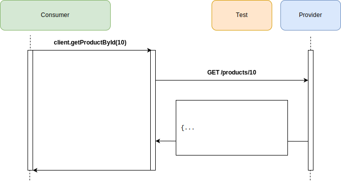
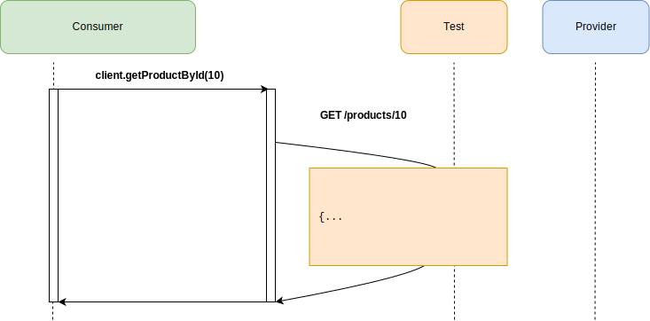

# Pact Maven + Springboot + JUnit5 workshop

## Introduction

This workshop is aimed at demonstrating core features and benefits of contract testing with Pact.

Whilst contract testing can be applied retrospectively to systems, we will follow the [consumer driven contracts](https://martinfowler.com/articles/consumerDrivenContracts.html) approach in this workshop - where a new consumer and provider are created in parallel to evolve a service over time, especially where there is some uncertainty with what is to be built.

This workshop should take from 1 to 2 hours, depending on how deep you want to go into each topic.

**Workshop outline**:

- [step 1: **create consumer**](https://github.com/pact-foundation/pact-workshop-Maven-Springboot-JUnit5/tree/step1#step-1---simple-consumer-calling-provider): Create our consumer before the Provider API even exists
- [step 2: **unit test**](https://github.com/pact-foundation/pact-workshop-Maven-Springboot-JUnit5/tree/step2#step-2---client-tested-but-integration-fails): Write a unit test for our consumer
- [step 3: **pact test**](https://github.com/pact-foundation/pact-workshop-Maven-Springboot-JUnit5/tree/step3#step-3---pact-to-the-rescue): Write a Pact test for our consumer
- [step 4: **pact verification**](https://github.com/pact-foundation/pact-workshop-Maven-Springboot-JUnit5/tree/step4#step-4---verify-the-provider): Verify the consumer pact with the Provider API
- [step 5: **fix consumer**](https://github.com/pact-foundation/pact-workshop-Maven-Springboot-JUnit5/tree/step5#step-5---back-to-the-client-we-go): Fix the consumer's bad assumptions about the Provider
- [step 6: **pact test**](https://github.com/pact-foundation/pact-workshop-Maven-Springboot-JUnit5/tree/step6#step-6---consumer-updates-contract-for-missing-products): Write a pact test for `404` (missing User) in consumer
- [step 7: **provider states**](https://github.com/pact-foundation/pact-workshop-Maven-Springboot-JUnit5/tree/step7#step-7---adding-the-missing-states): Update API to handle `404` case
- [step 8: **pact test**](https://github.com/pact-foundation/pact-workshop-Maven-Springboot-JUnit5/tree/step8#step-8---authorization): Write a pact test for the `401` case
- [step 9: **pact test**](https://github.com/pact-foundation/pact-workshop-Maven-Springboot-JUnit5/tree/step9#step-9---implement-authorisation-on-the-provider): Update API to handle `401` case
- [step 10: **request filters**](https://github.com/pact-foundation/pact-workshop-Maven-Springboot-JUnit5/tree/step10#step-10---request-filters-on-the-provider): Fix the provider to support the `401` case
- [step 11: **pact broker**](https://github.com/pact-foundation/pact-workshop-Maven-Springboot-JUnit5/tree/step11#step-11---using-a-pact-broker): Implement a broker workflow for integration with CI/CD

_NOTE: Each step is tied to, and must be run within, a git branch, allowing you to progress through each stage incrementally. For example, to move to step 2 run the following: `git checkout step2`_

## Learning objectives

If running this as a team workshop format, you may want to take a look through the [learning objectives](./LEARNING.md).

## Requirements

- JDK 8 or above
- Maven 3
- Docker for step 11

## Scenario

There are two components in scope for our workshop.

1. Product Catalog website. It provides an interface to query the Product service for product information.
1. Product Service (Provider). Provides useful things about products, such as listing all products and getting the details of an individual product.

## Step 1 - Simple Consumer calling Provider

We need to first create an HTTP client to make the calls to our provider service:


The Consumer has implemented the product service client which has the following:

- `GET /products` - Retrieve all products
- `GET /products/{id}` - Retrieve a single product by ID

The diagram below highlights the interaction for retrieving a product with ID 10:



You can see the service client interface we created in `consumer/src/main/java/io/pact/workshop/product_catalogue/clients/ProductServiceClient.java`:

```java
@Service
public class ProductServiceClient {
  @Autowired
  private RestTemplate restTemplate;

  @Value("${serviceClients.products.baseUrl}")
  private String baseUrl;

  public ProductServiceResponse fetchProducts() {
    return restTemplate.getForObject(baseUrl + "/products", ProductServiceResponse.class);
  }

  public Product fetchProductById(long id) {
    return restTemplate.getForObject(baseUrl + "/products/" + id, Product.class);
  }
}
```

After forking or cloning the repository, we need to build the app and install the dependencies. Run the following
in the `consumer` sub-directory:

```console
consumer ❯ ./mvnw verify
```

We can run the app with 

```console
consumer ❯ java -jar target/product-catalogue-0.0.1-SNAPSHOT.jar
```

Accessing the URL for the app in the browser gives us a 500 error page as the downstream service is not running. 
You will also see an exception in the Springboot console output.

```
 I/O error on GET request for "http://localhost:9000/products": Connection refused
```

*Move on to [step 2](https://github.com/pact-foundation/pact-workshop-Maven-Springboot-JUnit5/tree/step2#step-2---client-tested-but-integration-fails)*

## Step 2 - Client Tested but integration fails

Now let's create a basic test for our API client. We're going to check 2 things:

1. That our client code hits the expected endpoint
1. That the response is marshalled into an object that is usable, with the correct ID

You can see the client interface test we created in `consumer/src/test/java/io/pact/workshop/product_catalogue/clients/ProductServiceClientTest.java`:

```java
  @Test
  void getProductById(@Wiremock WireMockServer server, @WiremockUri String uri) {
      productServiceClient.setBaseUrl(uri);
      server.stubFor(
          get(urlPathEqualTo("/products/10"))
              .willReturn(aResponse()
              .withStatus(200)
              .withBody("{\n" +
                  "            \"id\": 50,\n" +
                  "            \"type\": \"CREDIT_CARD\",\n" +
                  "            \"name\": \"28 Degrees\",\n" +
                  "            \"version\": \"v1\"\n" +
                  "        }\n")
              .withHeader("Content-Type", "application/json"))
      );
    
      Product product = productServiceClient.getProductById(10);
      assertThat(product, is(equalTo(new Product(10L, "28 Degrees", "CREDIT_CARD", "v1"))));
  }
```





Let's run this test and see it all pass:

```console
consumer ❯ ./mvnw verify
[INFO] Scanning for projects...
[INFO] 
[INFO] -----------------< io.pact.workshop:product-catalogue >-----------------
[INFO] Building product-catalogue 0.0.1-SNAPSHOT
[INFO] --------------------------------[ jar ]---------------------------------
[INFO] 
[INFO] --- maven-resources-plugin:3.2.0:resources (default-resources) @ product-catalogue ---
[INFO] Using 'UTF-8' encoding to copy filtered resources.
[INFO] Using 'UTF-8' encoding to copy filtered properties files.
[INFO] Copying 1 resource
[INFO] Copying 0 resource
[INFO] 
[INFO] --- maven-compiler-plugin:3.8.1:compile (default-compile) @ product-catalogue ---
[INFO] Nothing to compile - all classes are up to date
[INFO] 
[INFO] --- maven-resources-plugin:3.2.0:testResources (default-testResources) @ product-catalogue ---
[INFO] Using 'UTF-8' encoding to copy filtered resources.
[INFO] Using 'UTF-8' encoding to copy filtered properties files.
[INFO] skip non existing resourceDirectory /home/ronald/Development/Projects/Pact/pact-workshop-Maven-Springboot-JUnit5/consumer/src/test/resources
[INFO] 
[INFO] --- maven-compiler-plugin:3.8.1:testCompile (default-testCompile) @ product-catalogue ---
[INFO] Changes detected - recompiling the module!
[INFO] Compiling 1 source file to /home/ronald/Development/Projects/Pact/pact-workshop-Maven-Springboot-JUnit5/consumer/target/test-classes
[INFO] 
[INFO] --- maven-surefire-plugin:2.22.2:test (default-test) @ product-catalogue ---
[INFO] 
[INFO] -------------------------------------------------------
[INFO]  T E S T S
[INFO] -------------------------------------------------------
[INFO] Running io.pact.workshop.product_catalogue.clients.ProductServiceClientTest

<<< Omitted lots of logs >>>

[INFO] Tests run: 2, Failures: 0, Errors: 0, Skipped: 0, Time elapsed: 1.952 s - in io.pact.workshop.product_catalogue.clients.ProductServiceClientTest
2021-02-25 13:37:46.510  INFO 25640 --- [extShutdownHook] o.s.s.concurrent.ThreadPoolTaskExecutor  : Shutting down ExecutorService 'applicationTaskExecutor'
[INFO] 
[INFO] Results:
[INFO] 
[INFO] Tests run: 2, Failures: 0, Errors: 0, Skipped: 0
[INFO] 
[INFO] 
[INFO] --- maven-jar-plugin:3.2.0:jar (default-jar) @ product-catalogue ---
[INFO] 
[INFO] --- spring-boot-maven-plugin:2.4.3:repackage (repackage) @ product-catalogue ---
[INFO] Replacing main artifact with repackaged archive
[INFO] ------------------------------------------------------------------------
[INFO] BUILD SUCCESS
[INFO] ------------------------------------------------------------------------
[INFO] Total time:  4.535 s
[INFO] Finished at: 2021-02-25T13:37:47+11:00
[INFO] ------------------------------------------------------------------------
```

If you encounter failing tests after running `./mvnw verify`, make sure that the current branch is `step2`.

Meanwhile, our provider team has started building out their API in parallel. Let's run our website against our provider (you'll need two terminals to do this):


```console
# Terminal 1
consumer ❯ mvn spring-boot:run

<<< Omitted >>>

  .   ____          _            __ _ _
 /\\ / ___'_ __ _ _(_)_ __  __ _ \ \ \ \
( ( )\___ | '_ | '_| | '_ \/ _` | \ \ \ \
 \\/  ___)| |_)| | | | | || (_| |  ) ) ) )
  '  |____| .__|_| |_|_| |_\__, | / / / /
 =========|_|==============|___/=/_/_/_/
 :: Spring Boot ::                (v2.4.3)

2021-02-25 13:46:36.835  INFO 26565 --- [           main] i.p.w.product_catalogue.Application      : Starting Application using Java 1.8.0_265 on ronald-P95xER with PID 26565 (/home/ronald/Development/Projects/Pact/pact-workshop-Maven-Springboot-JUnit5/consumer/target/classes started by ronald in /home/ronald/Development/Projects/Pact/pact-workshop-Maven-Springboot-JUnit5/consumer)
2021-02-25 13:46:36.836  INFO 26565 --- [           main] i.p.w.product_catalogue.Application      : No active profile set, falling back to default profiles: default
2021-02-25 13:46:37.274  INFO 26565 --- [           main] o.s.b.w.embedded.tomcat.TomcatWebServer  : Tomcat initialized with port(s): 8080 (http)
2021-02-25 13:46:37.279  INFO 26565 --- [           main] o.apache.catalina.core.StandardService   : Starting service [Tomcat]
2021-02-25 13:46:37.279  INFO 26565 --- [           main] org.apache.catalina.core.StandardEngine  : Starting Servlet engine: [Apache Tomcat/9.0.43]
2021-02-25 13:46:37.303  INFO 26565 --- [           main] o.a.c.c.C.[Tomcat].[localhost].[/]       : Initializing Spring embedded WebApplicationContext
2021-02-25 13:46:37.303  INFO 26565 --- [           main] w.s.c.ServletWebServerApplicationContext : Root WebApplicationContext: initialization completed in 441 ms
2021-02-25 13:46:37.405  INFO 26565 --- [           main] o.s.s.concurrent.ThreadPoolTaskExecutor  : Initializing ExecutorService 'applicationTaskExecutor'
2021-02-25 13:46:37.481  INFO 26565 --- [           main] o.s.b.w.embedded.tomcat.TomcatWebServer  : Tomcat started on port(s): 8080 (http) with context path ''
2021-02-25 13:46:37.486  INFO 26565 --- [           main] i.p.w.product_catalogue.Application      : Started Application in 0.866 seconds (JVM running for 1.051)

```

```console
# Terminal 2
provider ❯  mvn spring-boot:run

<<< Omitted >>>

  .   ____          _            __ _ _
 /\\ / ___'_ __ _ _(_)_ __  __ _ \ \ \ \
( ( )\___ | '_ | '_| | '_ \/ _` | \ \ \ \
 \\/  ___)| |_)| | | | | || (_| |  ) ) ) )
  '  |____| .__|_| |_|_| |_\__, | / / / /
 =========|_|==============|___/=/_/_/_/
 :: Spring Boot ::                (v2.4.3)

2021-02-25 16:06:08.671  INFO 40129 --- [           main] i.p.w.product_service.Application        : Starting Application using Java 1.8.0_265 on ronald-P95xER with PID 40129 (/home/ronald/Development/Projects/Pact/pact-workshop-Maven-Springboot-JUnit5/provider/target/classes started by ronald in /home/ronald/Development/Projects/Pact/pact-workshop-Maven-Springboot-JUnit5/provider)
2021-02-25 16:06:08.673  INFO 40129 --- [           main] i.p.w.product_service.Application        : No active profile set, falling back to default profiles: default
2021-02-25 16:06:08.990  INFO 40129 --- [           main] .s.d.r.c.RepositoryConfigurationDelegate : Bootstrapping Spring Data JPA repositories in DEFAULT mode.
2021-02-25 16:06:09.013  INFO 40129 --- [           main] .s.d.r.c.RepositoryConfigurationDelegate : Finished Spring Data repository scanning in 18 ms. Found 1 JPA repository interfaces.
2021-02-25 16:06:09.159  INFO 40129 --- [           main] trationDelegate$BeanPostProcessorChecker : Bean 'org.springframework.ws.config.annotation.DelegatingWsConfiguration' of type [org.springframework.ws.config.annotation.DelegatingWsConfiguration$$EnhancerBySpringCGLIB$$c6a6464a] is not eligible for getting processed by all BeanPostProcessors (for example: not eligible for auto-proxying)
2021-02-25 16:06:09.189  INFO 40129 --- [           main] .w.s.a.s.AnnotationActionEndpointMapping : Supporting [WS-Addressing August 2004, WS-Addressing 1.0]
2021-02-25 16:06:09.344  INFO 40129 --- [           main] o.s.b.w.embedded.tomcat.TomcatWebServer  : Tomcat initialized with port(s): 9000 (http)
2021-02-25 16:06:09.349  INFO 40129 --- [           main] o.apache.catalina.core.StandardService   : Starting service [Tomcat]
2021-02-25 16:06:09.349  INFO 40129 --- [           main] org.apache.catalina.core.StandardEngine  : Starting Servlet engine: [Apache Tomcat/9.0.43]
2021-02-25 16:06:09.382  INFO 40129 --- [           main] o.a.c.c.C.[Tomcat].[localhost].[/]       : Initializing Spring embedded WebApplicationContext
2021-02-25 16:06:09.382  INFO 40129 --- [           main] w.s.c.ServletWebServerApplicationContext : Root WebApplicationContext: initialization completed in 684 ms
2021-02-25 16:06:09.469  INFO 40129 --- [           main] com.zaxxer.hikari.HikariDataSource       : HikariPool-1 - Starting...
2021-02-25 16:06:09.525  INFO 40129 --- [           main] com.zaxxer.hikari.HikariDataSource       : HikariPool-1 - Start completed.
2021-02-25 16:06:09.549  INFO 40129 --- [           main] o.hibernate.jpa.internal.util.LogHelper  : HHH000204: Processing PersistenceUnitInfo [name: default]
2021-02-25 16:06:09.569  INFO 40129 --- [           main] org.hibernate.Version                    : HHH000412: Hibernate ORM core version 5.4.28.Final
2021-02-25 16:06:09.621  INFO 40129 --- [           main] o.hibernate.annotations.common.Version   : HCANN000001: Hibernate Commons Annotations {5.1.2.Final}
2021-02-25 16:06:09.702  INFO 40129 --- [           main] org.hibernate.dialect.Dialect            : HHH000400: Using dialect: org.hibernate.dialect.H2Dialect
2021-02-25 16:06:09.954  INFO 40129 --- [           main] o.h.e.t.j.p.i.JtaPlatformInitiator       : HHH000490: Using JtaPlatform implementation: [org.hibernate.engine.transaction.jta.platform.internal.NoJtaPlatform]
2021-02-25 16:06:09.958  INFO 40129 --- [           main] j.LocalContainerEntityManagerFactoryBean : Initialized JPA EntityManagerFactory for persistence unit 'default'
2021-02-25 16:06:10.093  WARN 40129 --- [           main] JpaBaseConfiguration$JpaWebConfiguration : spring.jpa.open-in-view is enabled by default. Therefore, database queries may be performed during view rendering. Explicitly configure spring.jpa.open-in-view to disable this warning
2021-02-25 16:06:10.149  INFO 40129 --- [           main] o.s.s.concurrent.ThreadPoolTaskExecutor  : Initializing ExecutorService 'applicationTaskExecutor'
2021-02-25 16:06:10.259  INFO 40129 --- [           main] o.s.b.w.embedded.tomcat.TomcatWebServer  : Tomcat started on port(s): 9000 (http) with context path ''
2021-02-25 16:06:10.265  INFO 40129 --- [           main] i.p.w.product_service.Application        : Started Application in 1.812 seconds (JVM running for 2.0)
2021-02-25 16:06:11.833  INFO 40129 --- [nio-9000-exec-1] o.a.c.c.C.[Tomcat].[localhost].[/]       : Initializing Spring DispatcherServlet 'dispatcherServlet'
2021-02-25 16:06:11.833  INFO 40129 --- [nio-9000-exec-1] o.s.web.servlet.DispatcherServlet        : Initializing Servlet 'dispatcherServlet'
2021-02-25 16:06:11.834  INFO 40129 --- [nio-9000-exec-1] o.s.web.servlet.DispatcherServlet        : Completed initialization in 1 ms
```

You should now see a screen showing 3 different products. There is a `Details ...` link which should display detailed product information.

Let's see what happens!


Doh! We are getting 500 everytime we try to view detailed product information. On closer inspection, 
we can see a 404 from the Product Service in the logs.

```
HttpClientErrorException$NotFound: 404 : [{"timestamp":"2021-02-25T05:27:51.264+00:00","status":404,"error":"Not Found","message":"","path":"/products/9"}]]
```

The issue is that the provider only knows about `/product/{id}` and `/products`.

We need to have a conversation about what the endpoint should be, but first...

*Move on to [step 3](https://github.com/pact-foundation/pact-workshop-Maven-Springboot-JUnit5/tree/step3#step-3---pact-to-the-rescue)*

## Step 3 - Pact to the rescue

Unit tests are written and executed in isolation of any other services. When we write tests for code that talk to
other services, they are built on trust that the contracts are upheld. There is no way to validate that the 
consumer and provider can communicate correctly.

> An integration contract test is a test at the boundary of an external service verifying that it meets the 
> contract expected by a consuming service — [Martin Fowler](https://martinfowler.com/bliki/IntegrationContractTest.html)

Adding contract tests via Pact would have highlighted the `/product/{id}` endpoint was incorrect.

Let us add Pact to the project and write a consumer pact test for the `GET /products/{id}` endpoint.

*Provider states* is an important concept of Pact that we need to introduce. These states help define the state that the provider should be in for specific interactions. For the moment, we will initially be testing the following states:

- `product with ID 10 exists`
- `products exist`

The consumer can define the state of an interaction using the `given` property.

Pact test `consumer/src/test/java/io/pact/workshop/product_catalogue/clients/ProductServiceClientPactTest.java`:

```java
@SpringBootTest
@ExtendWith(PactConsumerTestExt.class)
@PactTestFor(providerName = "ProductService")
class ProductServiceClientPactTest {
  @Autowired
  private ProductServiceClient productServiceClient;

  @Pact(consumer = "ProductCatalogue")
  public RequestResponsePact allProducts(PactDslWithProvider builder) {
    return builder
      .given("products exists")
      .uponReceiving("get all products")
      .path("/products")
      .willRespondWith()
      .status(200)
      .body(
        new PactDslJsonBody()
          .minArrayLike("products", 1, 2)
          .integerType("id", 9L)
          .stringType("name", "Gem Visa")
          .stringType("type", "CREDIT_CARD")
          .closeObject()
          .closeArray()
      )
      .toPact();
  }

  @Pact(consumer = "ProductCatalogue")
  public RequestResponsePact singleProduct(PactDslWithProvider builder) {
    return builder
      .given("product with ID 10 exists", "id", 10)
      .uponReceiving("get product with ID 10")
      .path("/products/10")
      .willRespondWith()
      .status(200)
      .body(
        new PactDslJsonBody()
          .integerType("id", 10L)
          .stringType("name", "28 Degrees")
          .stringType("type", "CREDIT_CARD")
          .stringType("code", "CC_001")
          .stringType("version", "v1")
      )
      .toPact();
  }

  @Test
  @PactTestFor(pactMethod = "allProducts", port="9999")
  void testAllProducts(MockServer mockServer) throws IOException {
    productServiceClient.setBaseUrl(mockServer.getUrl());
    List<Product> products = productServiceClient.fetchProducts().getProducts();
    assertThat(products, hasSize(2));
    assertThat(products.get(0), is(equalTo(new Product(9L, "Gem Visa", "CREDIT_CARD", null, null))));
  }

  @Test
  @PactTestFor(pactMethod = "singleProduct", port="9999")
  void testSingleProduct(MockServer mockServer) throws IOException {
    Product product = productServiceClient.getProductById(10L);
    assertThat(product, is(equalTo(new Product(10L, "28 Degrees", "CREDIT_CARD", "v1", "CC_001"))));
  }
}
```


These tests starts a mock server on a random port that acts as our provider service. To get this to work we update the 
URL in the `ProductServiceClient` to point to the mock server that Pact provides for the test.

Running this test also passes, but it creates a pact file which we can use to validate our assumptions on the 
provider side, and have conversation around.

```console
consumer ❯ ./mvnw verify
[INFO] Scanning for projects...
[INFO] 
[INFO] -----------------< io.pact.workshop:product-catalogue >-----------------
[INFO] Building product-catalogue 0.0.1-SNAPSHOT
[INFO] --------------------------------[ jar ]---------------------------------
[INFO] 
[INFO] --- maven-resources-plugin:3.2.0:resources (default-resources) @ product-catalogue ---
[INFO] Using 'UTF-8' encoding to copy filtered resources.
[INFO] Using 'UTF-8' encoding to copy filtered properties files.
[INFO] Copying 1 resource
[INFO] Copying 6 resources
[INFO] 
[INFO] --- maven-compiler-plugin:3.8.1:compile (default-compile) @ product-catalogue ---
[INFO] Nothing to compile - all classes are up to date
[INFO] 
[INFO] --- maven-resources-plugin:3.2.0:testResources (default-testResources) @ product-catalogue ---
[INFO] Using 'UTF-8' encoding to copy filtered resources.
[INFO] Using 'UTF-8' encoding to copy filtered properties files.
[INFO] skip non existing resourceDirectory /home/ronald/Development/Projects/Pact/pact-workshop-Maven-Springboot-JUnit5/consumer/src/test/resources
[INFO] 
[INFO] --- maven-compiler-plugin:3.8.1:testCompile (default-testCompile) @ product-catalogue ---
[INFO] Changes detected - recompiling the module!
[INFO] Compiling 2 source files to /home/ronald/Development/Projects/Pact/pact-workshop-Maven-Springboot-JUnit5/consumer/target/test-classes
[INFO] 
[INFO] --- maven-surefire-plugin:2.22.2:test (default-test) @ product-catalogue ---
[INFO] 
[INFO] -------------------------------------------------------
[INFO]  T E S T S
[INFO] -------------------------------------------------------

<<< Omitted >>>

[INFO] 
[INFO] Results:
[INFO] 
[INFO] Tests run: 4, Failures: 0, Errors: 0, Skipped: 0
[INFO] 
[INFO] 
[INFO] --- maven-jar-plugin:3.2.0:jar (default-jar) @ product-catalogue ---
[INFO] Building jar: /home/ronald/Development/Projects/Pact/pact-workshop-Maven-Springboot-JUnit5/consumer/target/product-catalogue-0.0.1-SNAPSHOT.jar
[INFO] 
[INFO] --- spring-boot-maven-plugin:2.4.3:repackage (repackage) @ product-catalogue ---
[INFO] Replacing main artifact with repackaged archive
[INFO] ------------------------------------------------------------------------
[INFO] BUILD SUCCESS
[INFO] ------------------------------------------------------------------------
[INFO] Total time:  6.013 s
[INFO] Finished at: 2021-02-26T09:43:03+11:00
[INFO] ------------------------------------------------------------------------
```

A pact file should have been generated in *consumer/target/pacts/ProductCatalogue-ProductService.json*

*NOTE*: even if the API client had been graciously provided for us by our Provider Team, it doesn't mean that we 
shouldn't write contract tests - because the version of the client we have may not always be in sync with the 
deployed API - and also because we will write tests on the output appropriate to our specific needs.

*Move on to [step 4](https://github.com/pact-foundation/pact-workshop-Maven-Springboot-JUnit5/tree/step4#step-4---verify-the-provider)*

## Step 4 - Verify the provider

We will need to copy the Pact contract file that was produced from the consumer test into the Provider module. 
This will help us verify that the provider can meet the requirements as set out in the contract.

Copy the contract located in `consumer/target/pacts/ProductCatalogue-ProductService.json` to `provider/pacts/ProductCatalogue-ProductService.json`.

Now let's make a start on writing a Pact test to validate the consumer contract:

In `provider/src/test/java/io/pact/workshop/product_service/PactVerificationTest.java`:

```java
@SpringBootTest(webEnvironment = SpringBootTest.WebEnvironment.RANDOM_PORT)
@Provider("ProductService")
@PactFolder("pacts")
@IgnoreMissingStateChange
public class PactVerificationTest {
  @LocalServerPort
  private int port;

  @Autowired
  private ProductRepository productRepository;

  @BeforeEach
  void setup(PactVerificationContext context) {
    context.setTarget(new HttpTestTarget("localhost", port));
  }

  @TestTemplate
  @ExtendWith(PactVerificationInvocationContextProvider.class)
  void pactVerificationTestTemplate(PactVerificationContext context) {
    context.verifyInteraction();
  }
}
```

This is a Springboot test that starts the app on a random port, and then injects the port into the test class.
We then setup the test context using some annotations on the test class that tells the Pact framework who the
provider is and where the pact files are. We also set the test target to point to the running app.

We now need to validate the pact generated by the consumer is valid by running the test, which should fail:

```console
provider ❯ ./mvnw verify

<<< Omitted >>>

1) Verifying a pact between ProductCatalogue and ProductService - get product with ID 10: has status code 200

    1.1) status: expected status of 200 but was 404

    1.2) body: $ Expected code='CC_001' but was missing

        {
        -  "code": "CC_001",
        -  "id": 10,
        -  "name": "28 Degrees",
        -  "type": "CREDIT_CARD",
        -  "version": "v1"
        +  "timestamp": "2021-02-26T02:50:41.293+00:00",
        +  "status": 404,
        +  "error": "Not Found",
        +  "message": "",
        +  "path": "/products/10"
        }

<<< Omitted >>>
    
```


The test has failed, as the expected path `/products/{id}` is returning 404. We incorrectly believed our provider was following a RESTful design, but the authors were too lazy to implement a better routing solution 🤷🏻‍♂️.

The correct endpoint which the consumer should call is `/product/{id}`.

Move on to [step 5](https://github.com/pact-foundation/pact-workshop-Maven-Springboot-JUnit5/tree/step5#step-5---back-to-the-client-we-go)

## Step 5 - Back to the client we go

We now need to update the consumer client and tests to hit the correct product path.

First, we need to update the GET route for the client:

In `consumer/src/main/java/io/pact/workshop/product_catalogue/clients/ProductServiceClient.java`:

```java
  public Product getProductById(long id) {
    return restTemplate.getForObject(baseUrl + "/product/" + id, Product.class);
  }
```

Then we need to update the Pact test `ID 10 exists` to use the correct endpoint in `path`.

In `consumer/src/test/java/io/pact/workshop/product_catalogue/clients/ProductServiceClientPactTest.java`:

```java
  @Pact(consumer = "ProductCatalogue")
  public RequestResponsePact singleProduct(PactDslWithProvider builder) {
    return builder
      .given("product with ID 10 exists", "id", 10)
      .uponReceiving("get product with ID 10")
        .path("/product/10")
      .willRespondWith()
        .status(200)
        .body(
          new PactDslJsonBody()
            .integerType("id", 10L)
            .stringType("name", "28 Degrees")
            .stringType("type", "CREDIT_CARD")
            .stringType("code", "CC_001")
            .stringType("version", "v1")
        )
      .toPact();
  }
```


Let's run and generate an updated pact file on the consumer:

```console
❯ ./mvnw verify

<<< Omitted >>>

[INFO] 
[INFO] Results:
[INFO] 
[INFO] Tests run: 4, Failures: 0, Errors: 0, Skipped: 0
[INFO] 
[INFO] 
[INFO] --- maven-jar-plugin:3.2.0:jar (default-jar) @ product-catalogue ---
[INFO] Building jar: /home/ronald/Development/Projects/Pact/pact-workshop-Maven-Springboot-JUnit5/consumer/target/product-catalogue-0.0.1-SNAPSHOT.jar
[INFO] 
[INFO] --- spring-boot-maven-plugin:2.4.3:repackage (repackage) @ product-catalogue ---
[INFO] Replacing main artifact with repackaged archive
[INFO] ------------------------------------------------------------------------
[INFO] BUILD SUCCESS
[INFO] ------------------------------------------------------------------------
```

Now we run the provider tests again with the updated contract

Copy the updated contract located in `consumer/target/pacts/ProductCatalogue-ProductService.json` to `provider/pacts`.

Run the command:

```console
❯ ./mvnw verify

<<< Omitted >>>

Verifying a pact between ProductCatalogue and ProductService
  [Using File pacts/ProductCatalogue-ProductService.json]
  Given product with ID 10 exists
  get product with ID 10
2021-02-26 13:11:45.229  INFO 96199 --- [o-auto-1-exec-1] o.a.c.c.C.[Tomcat].[localhost].[/]       : Initializing Spring DispatcherServlet 'dispatcherServlet'
2021-02-26 13:11:45.229  INFO 96199 --- [o-auto-1-exec-1] o.s.web.servlet.DispatcherServlet        : Initializing Servlet 'dispatcherServlet'
2021-02-26 13:11:45.230  INFO 96199 --- [o-auto-1-exec-1] o.s.web.servlet.DispatcherServlet        : Completed initialization in 1 ms
    returns a response which
      has status code 200 (OK)
      has a matching body (OK)
2021-02-26 13:11:45.356  WARN 96199 --- [           main] a.c.d.p.p.DefaultTestResultAccumulator   : Not all of the 2 were verified. The following were missing:
2021-02-26 13:11:45.356  WARN 96199 --- [           main] a.c.d.p.p.DefaultTestResultAccumulator   :     get all products
2021-02-26 13:11:45.366  INFO 96199 --- [           main] p.j.PactVerificationStateChangeExtension : Invoking state change method 'products exists':SETUP

Verifying a pact between ProductCatalogue and ProductService
  [Using File pacts/ProductCatalogue-ProductService.json]
  Given products exists
  get all products
    returns a response which
      has status code 200 (OK)
      has a matching body (OK)
2021-02-26 13:11:45.485  WARN 96199 --- [           main] a.c.d.p.p.DefaultTestResultAccumulator   : Skipping publishing of verification results as it has been disabled (pact.verifier.publishResults is not 'true')
[INFO] Tests run: 2, Failures: 0, Errors: 0, Skipped: 0, Time elapsed: 4.573 s - in io.pact.workshop.product_service.PactVerificationTest
2021-02-26 13:11:45.527  INFO 96199 --- [extShutdownHook] o.s.s.concurrent.ThreadPoolTaskExecutor  : Shutting down ExecutorService 'applicationTaskExecutor'
2021-02-26 13:11:45.527  INFO 96199 --- [extShutdownHook] j.LocalContainerEntityManagerFactoryBean : Closing JPA EntityManagerFactory for persistence unit 'default'
2021-02-26 13:11:45.528  INFO 96199 --- [extShutdownHook] .SchemaDropperImpl$DelayedDropActionImpl : HHH000477: Starting delayed evictData of schema as part of SessionFactory shut-down'
2021-02-26 13:11:45.532  INFO 96199 --- [extShutdownHook] com.zaxxer.hikari.HikariDataSource       : HikariPool-1 - Shutdown initiated...
2021-02-26 13:11:45.534  INFO 96199 --- [extShutdownHook] com.zaxxer.hikari.HikariDataSource       : HikariPool-1 - Shutdown completed.
[INFO] 
[INFO] Results:
[INFO] 
[INFO] Tests run: 2, Failures: 0, Errors: 0, Skipped: 0
[INFO]
```

Yay - green ✅!

Move on to [step 6](https://github.com/pact-foundation/pact-workshop-Maven-Springboot-JUnit5/tree/step6#step-6---consumer-updates-contract-for-missing-products)
